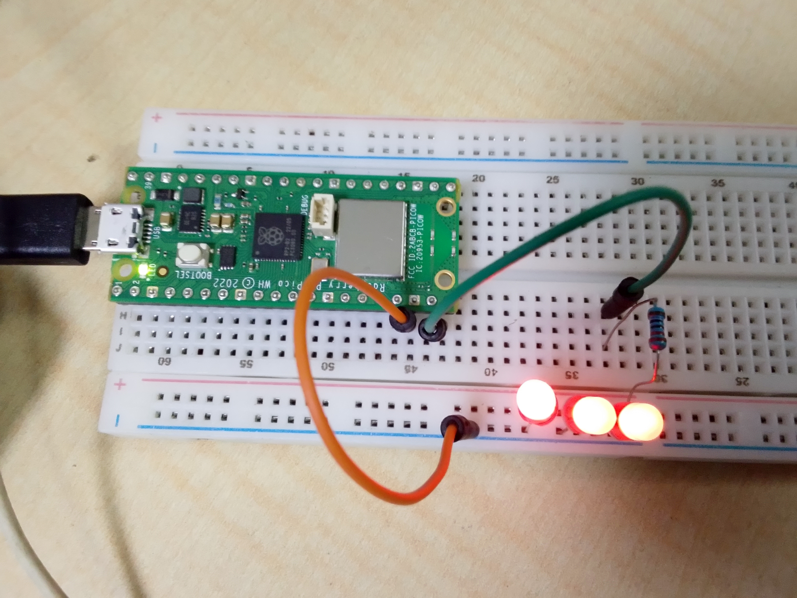

# External-LED-Blink-using-Raspberry-Pi-Pico-W
This project demonstrates how to control an external LED using GPIO output on the Raspberry Pi Pico W with MicroPython.

## How it works
An LED connected to GPIO 15 is turned ON and OFF repeatedly with a 1-second delay.

## Code behavior
- LED ON for 1 second
- LED OFF for 1 second
- Continuous loop execution

## Components Used
- Raspberry Pi Pico W
- LED
- 220Ω resistor
- Breadboard
- Jumper wires

## Learning outcome
- GPIO output control
- External component interfacing
- Basic electronic circuit connection
- Digital signal output using MicroPython

## Project Images

## Project Code
[Click here for the project code](code/blinking_output_led_light.py)

## Project video
[Click here for the project video](https://youtube.com/shorts/PccMaG9bXmE?si=TnK7JN5h-V09lmyr)
